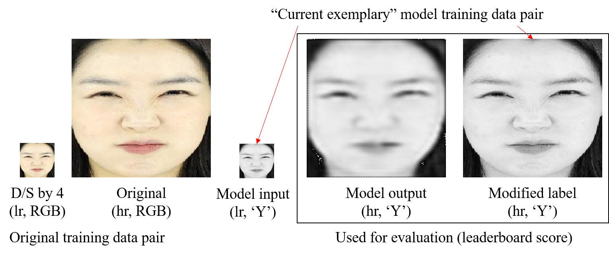

# NIPAFacesSR
Baseline code for Face Super Resolution (x4)
### Dataset description: 15_ig_super
 

```
15_ig_super
    \_train
        \_ train_data (folder)
            \_ hr (folder) 
            \_ lr (folder)
``` 
Please refer to http://www.aihub.or.kr/content/140 for entire face dataset description. Among 200 people dataset, we chose randomly 58 people and again reduced the number of data by randomly selecting 100 images per person. Originally, the dataset had 32,400 per person, which is too much for challenge purpose. Therefore, our images would include random lightings, accessories, views and emotions. 

The lr folder has 56 x 56 RGB images (total 48,000 images, 100 images per person: 48 people), which are inputs and the hr folder includes corresponding 224 x 224 resolution RGB images, which are labels. If you want to train your model with RGB input format, please change the data_local_loader.py accordingly. Currently, the exemplar code is only using the _"Y"_ channel (YCbCr) of the image, which means that the input of the model has a single channel.


### Evaluation description
Please note that **PSNR is calculated using the _"Y"_ channel (YCbCr) only**. Therefore, your model **should be able to give the best performance on Y channel** and the output of the model should be converted to a single channel accordingly. For example, you can still make a model that use the RGB channel images as input and output, but **you should make sure that the infer function returns a "Y"-channel to the system.** Please refer to evaluation.py file for more details. The test dataset has 56 x 56 RGB images (total 10,000 images, 100 images per person: 10 people), which has no overlap to the training data id (different people).

### How to run 
```
nsml run  -d 15_ig_super -g 1 --memory 12G --cpus 1 -e main.py
```
: You are running "main.py" as main on the dataset "15_ig_super"
### How to check your session logs
```
nsml logs -f [Session Name Here] 
e.g., nsml logs -f KR18838/15_ig_super/4
```
: -f is given to follow the logs. Instead of this, you can simply watch the web interface to track the logs.
### How to submit
```
nsml submit [Session Name Here] [Model # Here]
e.g., nsml submit KR18838/15_ig_super/4 1 # ID/Dataset/Session# Model#
```
: You are submitting your learned 1st model (which gives the best score, usually it would be last epoch model) of session KR18838/15_ig_super/4
### How to check the leaderboard
```
nsml dataset board 15_ig_super
```
