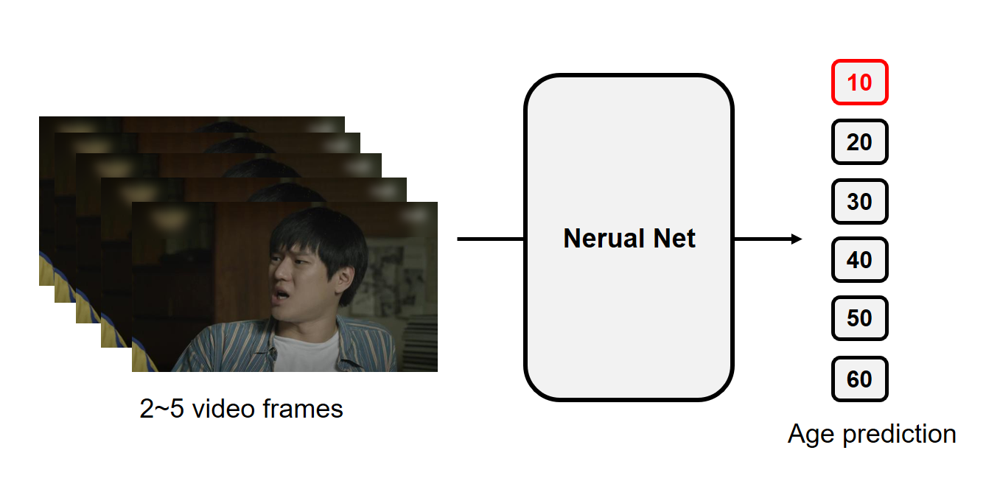

# video-age-classification

<p align="center"></p>


### 1. Description
The baseline code contains a data loader which is implemented to receive only up to five frames. If data sample contains less than five frames, the data loader adds zero paddings so that the input tensor has a fixed dimension ((3x5)x180x320, 3 for RGB channels). You can change the baseline code to deal with a variable number of frames. The below is a description of training and test dataset.


```
number of age classes: 6
number of train samples (frames and label pairs): 24648
number of test samples (frames and label pairs): 3000
evaluation metric: F1 score with macro average
image resolution: 3x180x320
```

<br/>

### 2. Usage

#### How to run

To train your age classifier on the dataset "6_vcls_age", run the command below.

```
nsml run -v -d 6_vcls_age --shm-size 24G -e main.py
```

#### How to check session logs
```
nsml logs -f [SESSION_NAME] # e.g., nsml logs -f nsmlteam/6_vcls_age/1
```

#### How to list checkpoints saved
You can search model checkpoints by using the following command:
```
nsml model ls nsmlteam/6_vcls_age/1
```

#### How to submit
The following command is an example of running the evaluation code using the model checkpoint at 10th epoch.
```
nsml submit -v nsmlteam/6_vcls_age/1 10
```

#### How to check leaderboard
```
nsml dataset board 6_vcls_age
```
