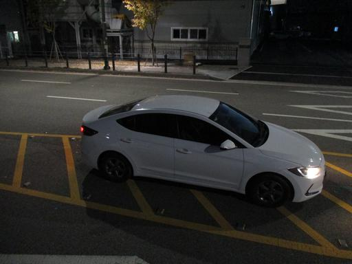
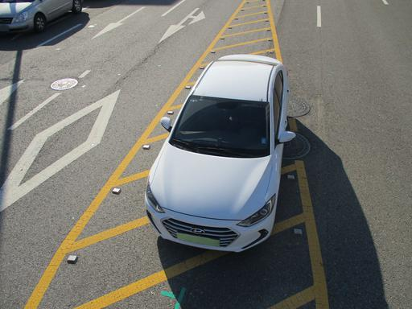
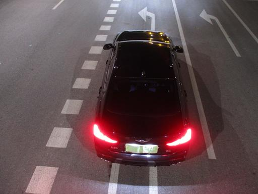

# Car Retrieval

Baseline codes and explanations for the car retrieval task.

## Task explanation

Information retrieval is a task for searching images containing the same information of the input image. You have a "query" image (input image) and "gallery" or "candidate" images (images in the database).

Consider an example in the below table:

|    | input | sample1 | sample2 |
|----|-------|---------|---------|
| samples |  |  |  |
| classes | class_A | class_A | class_B |

Your model should distinguish that **input** and **sample1** are in the same class (`class_A`), while **sample2** is in a different class (`class_B`).

We assume that your model doesn't know any information in the test set, i.e., your model shouldn't be a simple classifier. We provide a simple baseline retrieval model based on ResNet-18.

## Evaluation explanation

In this task, your model will return the nearest sample of the given query image.
We will measure the top-1 classification accuracy.

Consider you have four images with class `[dog, dog, cat, cat]` and assume your model predict the nearest sample for every image as the following.

| query image id | the nearest image id | query class | nearest class | correct? |
|----------------|----------------------|-------------|---------------|----------|
| Image1         | Image2               | dog         | dog           | Yes      |
| Image2         | Image3               | dog         | cat           | No       |
| Image3         | Image4               | cat         | cat           | Yes      |
| Image4         | Image3               | cat         | cat           | Yes      |

In this case, your model has a score `0.75 = 3/4`.

For the baseline score, our provided baseline model achieves `0.8449212384573601`.

## Dataset explanation

| Split | Number of Classes | Number of Samples |
|-------|-------------------|-------------------|
| Train | 84                | 53,813            |
| Test  | 78                | 11,046            |
| Test submit | 4           | 20                |

- Image resolution: 512 x 384
- Environments
    - Rotations (15 degree interval. `[0, 15, ..., 345]`)
    - Time zone (morning, noon, afternoon, and night)

In this task, we set the "name of car" as classes.
For example, "아반떼 HD (red)" and "아반떼 MD (silver)" are in the same class "아반떼."

## Step-by-step tutorial

### Run your code

```bash
nsml run -v -d 9_iret_car
```

**More tips**

- You can specify more options for nsml! See `nsml run --help`.
- You can check your progress using `nsml logs [your_session_name]`
    - e.g., `nsml logs username/9_iret_car/1`

### Prepare submit

```bash
nsml model ls [your_session_name]
# e.g., nsml model ls username/9_iret_car/1
```

Check your models.

### Submit your model

```bash
nsml submit -v [your_session_name] [model_name]
# e.g., nsml model ls username/9_iret_car/1 100
```

It will take about 5 minutes.

## Baseline model

Here is detailed explanation of our example model.

- We train ResNet-18 using classification loss on the training set.
- We extract the features from the last layer of trained ResNet-18.
- We select the nearest sample using the cosine similarity between a query image and candidate images.